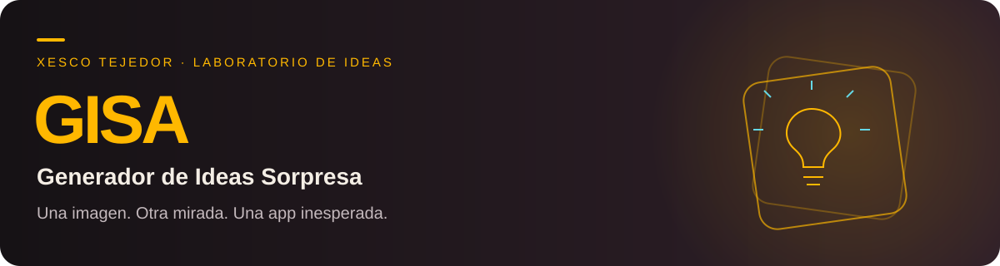

<p align="center"></p>

<p align="center"><a href="https://xesco-tejedor.github.io/GISA/"></a></p>

## Una imagen. Otra mirada. Una app inesperada.

El **Generador de Ideas Sorpresa (Académico)** es una herramienta que utiliza la visión y la creatividad lateral de modelos de IA gratuitos para generar conceptos de meta-aplicaciones inesperadas para la comunidad de investigadores, lectores y bibliotecarios.

El acrónimo del proyecto es **GISA** (Generador de Ideas Sorpresa (Académico)).

-----

### 🚀 ¿Qué es GISA?

GISA es una aplicación web sencilla diseñada para estimular el pensamiento lateral. El usuario sube una imagen y, basándose en el estado de ánimo, los colores y los objetos de la imagen (pero sin relacionarse directamente con su contenido), la aplicación genera un *prompt* profesional en inglés para una mini-aplicación completamente abstracta y sorprendente en el ámbito académico.

El concepto de la aplicación es una **metáfora abstracta** de lo que se ve, asegurando que el resultado sea siempre inesperado. Por ejemplo, una imagen de una puesta de sol tranquila podría inspirar un concepto para una "Aplicación de Gestión de Crisis de Datos" para investigadores.

### ✨ Características

  * **Identidad ámbar:** Fondos carbón y burdeos, acento #ffb800, Space Grotesk, luz suave y movimiento discreto, como el portfolio de Xesco Tejedor. Respeta la preferencia de movimiento reducido.
  * **Cámara y navegación:** Usa la cámara del dispositivo, vuelve al inicio o empieza con otra imagen o una nueva foto.

  * **Entrada Visual:** Sube cualquier imagen (JPG, PNG) para iniciar el proceso creativo.
  * **Creatividad Lateral:** Utiliza modelos de visión gratuitos de OpenRouter con instrucciones de sistema diseñadas para el pensamiento abstracto y la generación de metáforas.
  * **Output Profesional:** Genera directamente el *prompt* en **inglés** listo para ser utilizado en Google AI Studio (o cualquier herramienta de desarrollo impulsada por IA).
  * **Construcción:** Copia el *prompt* y abre AI Studio o Bolt con la idea prellenada. GISA no crea ni publica automáticamente una app. Los límites y las condiciones de publicación dependen de cada plataforma.

### ⚙️ Tecnología Utilizada

Este proyecto es un **solo archivo HTML** y utiliza tecnologías web estándar:

  * **HTML5 y JavaScript:** Para la estructura y la lógica principal.
  * **Tailwind CSS:** Para un diseño moderno, responsivo y de carga rápida.
  * **OpenRouter gratuito:** Análisis de imágenes y generación creativa mediante un servidor intermediario. La ruta selecciona modelos de visión `:free` y puede usar una alternativa gratuita cuando el primero no está disponible.

### 💻 Instalación y Uso

Dado que el proyecto es un solo archivo `index.html` con *scripts* en línea, la instalación es muy sencilla:

1.  **Clonar el Repositorio:**
    ```bash
    git clone https://github.com/Xesco-Tejedor/GISA.git
    cd GISA
    ```
2.  **Abrir el Archivo:** Simplemente abre el archivo `index.html` en tu navegador web.

#### Configuración de la API

Demo: https://xesco-tejedor.github.io/GISA/

No necesitas pegar ninguna clave para usar la demo. La clave de OpenRouter vive como secreto en el servidor intermediario, nunca en el código público. Su ruta `/openrouter` va en `PROXY_URL`. Para alojar tu propia instancia, despliega un servidor equivalente con los secretos fuera del navegador. La espera se limita a 45 segundos: si el servicio no responde, se muestra un aviso y puedes volver a intentarlo.

### 📝 Cómo Contribuir

¡Las contribuciones son bienvenidas\! Si tienes ideas para mejorar la lógica del *prompt* del sistema, el diseño, o la usabilidad, no dudes en:

1.  Hacer un *Fork* del repositorio.
2.  Crear una nueva rama (`git checkout -b feature/mejora-increible`).
3.  Realizar tus cambios y hacer *commit* (`git commit -m 'Añadir: Funcionalidad X'`).
4.  Subir la rama (`git push origin feature/mejora-increible`).
5.  Abrir un *Pull Request* detallado.

### Privacidad y cuotas

La imagen se envía al proveedor de IA mediante el servidor intermediario. Las cuotas gratuitas pueden limitar la generación. Nunca publiques claves de API en el código del navegador.
